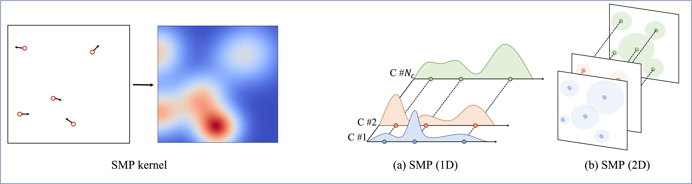

# SMPConv: Self-moving Point Representations for Continuous Convolution

[Sanghyeon Kim](https://github.com/sangnekim) and [Eunbyung Park](https://silverbottlep.github.io/)

**Sungkyunkwan University**  

**IEEE / CVF Computer Vision and Pattern Recognition Conference (CVPR), 2023**

[paper]()

## Abstract
*Continuous convolution has recently gained prominence due to its ability to handle irregularly sampled data and model long-term dependency. Also, the promising experimental results of using large convolutional kernels have catalyzed the development of continuous convolution since they can construct large kernels very efficiently. Leveraging neural networks, more specifically multilayer perceptrons (MLPs), is by far the most prevalent approach to implementing continuous convolution. However, there are a few drawbacks, such as high computational costs, complex hyperparameter tuning, and limited descriptive power of filters. This paper suggests an alternative approach to building a continuous convolution without neural networks, resulting in more computationally efficient and improved performance. We present self-moving point representations where weight parameters freely move, and interpolation schemes are used to implement continuous functions. When applied to construct convolutional kernels, the experimental results have shown improved performance with drop-in replacement in the existing frameworks. Due to its lightweight structure, we are first to demonstrate the effectiveness of continuous convolution in a large-scale setting, e.g., ImageNet, presenting the improvements over the prior arts.*





## Repo overview

Since we conducted various experiments, we divided repository with two main directory.

* `smp`: Sequential data classifications and image classification with CIFAR10

* `smp_imagenet`: Image classification with ImageNet-1k

## Requirements
Tested on Ubuntu 18.04 + CUDA 11.3 + cudnn 8.2.0 + PyTorch 1.10.0 with A100 GPUs
```
conda create -n smpconv python=3.8
conda activate smpconv
conda install pytorch==1.10.0 torchvision==0.11.0 torchaudio==0.10.0 cudatoolkit=11.3 -c pytorch -c conda-forge
pip install -r requirements.txt
```
For `smp_imagenet`, we follow [RepLKNet](https://github.com/DingXiaoH/RepLKNet-pytorch#use-our-efficient-large-kernel-convolution-with-pytorch) and install the efficient large-kernel convolution with PyTorch provided by MegEngine:

1. ```cd smp_imagenet/cutlass/examples/19_large_depthwise_conv2d_torch_extension```
2. ```./setup.py install --user```. If you get errors, (1) check your ```CUDA_HOME```; (2) you might need to change the source code a bit to make tensors contiguous see [here](https://github.com/Shiweiliuiiiiiii/SLaK/blob/3f8b1c46eee34da440afae507df13bc6307c3b2c/depthwise_conv2d_implicit_gemm.py#L25) for example. 
3. A quick check: ```python depthwise_conv2d_implicit_gemm.py```

**Note !**  
We trained and tested ```smp``` with **pytorch 1.12.1**
```
pip install torch==1.12.1+cu113 torchvision==0.13.1+cu113 torchaudio==0.12.1 --extra-index-url https://download.pytorch.org/whl/cu113
```

## Run code
Run code in each directory.  
* [smp]()
* [smp_imagenet]()

## Acknowledgement
The ```smp``` training script is based on the code of [CKConv](https://github.com/dwromero/ckconv) and [FlexConv](https://github.com/rjbruin/flexconv).  

The ```smp_imagenet``` training script is based on the code of [RepLKNet](https://github.com/DingXiaoH/RepLKNet-pytorch) and [SLaK](https://github.com/VITA-Group/SLaK), which were built using the [timm](https://github.com/huggingface/pytorch-image-models) library, [DeiT](https://github.com/facebookresearch/deit) and [BEiT](https://github.com/microsoft/unilm/tree/master/beit) repositories.  

We sincerely thank their studies and releasing code implementation.

## License
This project is released under the MIT license.

## Citation

```
@article{kim2023smpconv,
  author    = {Kim, Sanghyeon and Park, Eunbyung},
  title     = {SMPConv: Self-moving Point Representations for Continuous Convolution},
  booktitle = {Proceedings of the IEEE/CVF Conference on Computer Vision and Pattern Recognition (CVPR)},
  month     = {June},
  year      = {2023},
}
```

